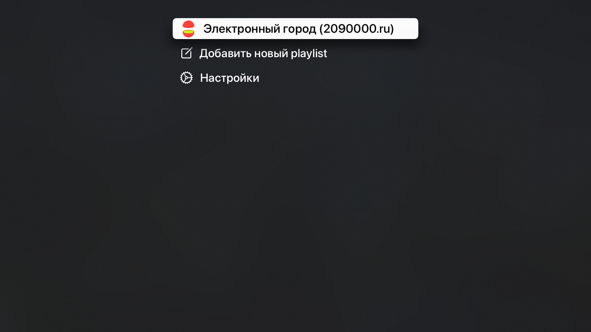
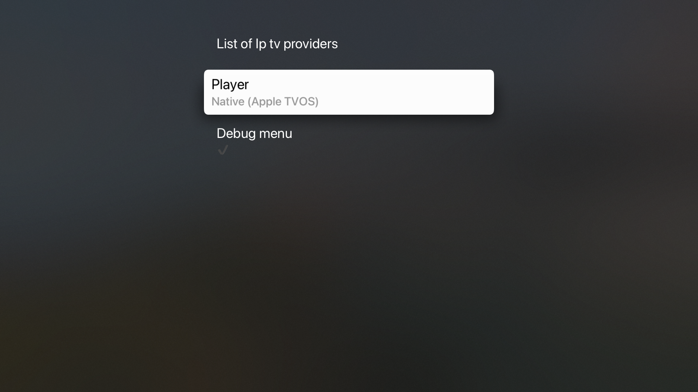
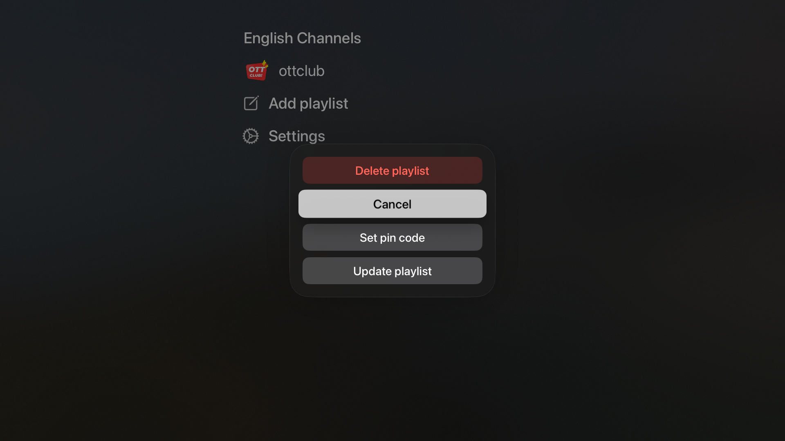

# Apple TV player

## Supported formats

- IPTV protocol (m3u, m3u8)

## State

- Development is in progress...

## Motivation

Most of Russian TV providers have only SmartTV applications to show their streaming channels, some of them (applications) have bad UX, some have ads even when service charges monthly payments. Things not so bad actually, all providers provide m3u playlists that can be used to stream its services as you want (I had used VLC for), but it is not always convenient, on MacOS it is okay, but on Apple TV there are only a few "ok" free players that can just play m3u formats without categorizing channels somehow. 

This app can play playlists in m3u format if able to parse, but main goal to support all providers out there in the best way it can.

## Supported providers

- Электронный город (https://2090000.ru)
- Сибирские сети (https://nsk.sibset.ru) - **TBD**

## Localization

- RU
- EN

----

