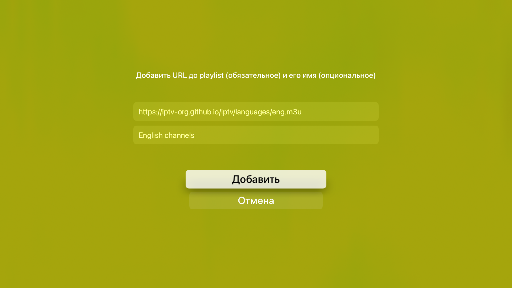
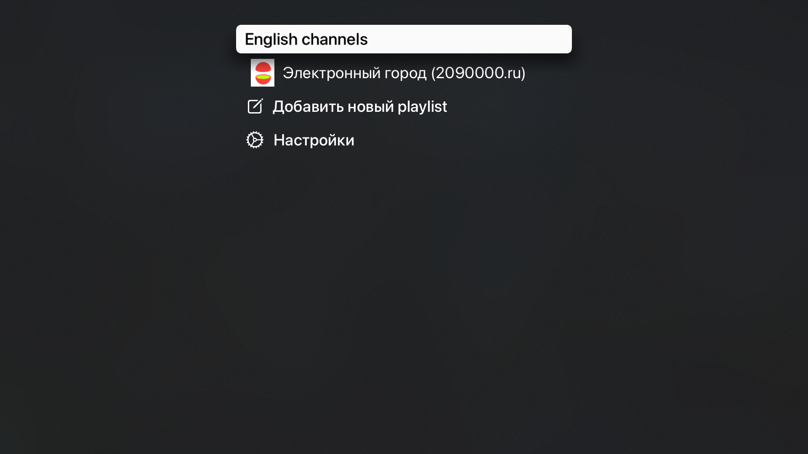

## Apple TV player

### Supported formats

- IPTV protocol (m3u, m3u8)

### State

- Development is in progress...

### Description

This app can play the playlists in m3u/m3u8 formats when able to parse.

### Supported playlists

Over 8000 channels are available https://github.com/iptv-org/iptv (not mine, please star the project)

### Localization

- RU
- EN

### How to Build

1. Set your Development Team and BundleID for files:

- Apple-TV-Player/Configuration/Debug.xcconfig
- Channels/Configuration/Debug-Channels.xcconfig

or just change them via Xcode `Signing & Capabilities` tab for `Apple-TV-Player` and `Channels` projects.

2. Select your Apple TV and hit Xcode build/run button.

### How to pair Apple TV to Xcode

- Make sure Mac and Apple TV have the same network ("AirPlay and HomeKit" > "Allow Access" is set to "Anyone in the Same Network")
- In Xcode open "Devices & Simulators" window
- On Apple TV open "Remote App And Device" > "Remote App And Device"
- Click "pair" and enter code
- If "pair" reappear again then turn off the wifi on your Mac for 10 seconds and then turn it on back (https://developer.apple.com/forums/thread/108459)
- Maybe needed to delete the TV from ignored list https://stackoverflow.com/a/63195311/3614746

### How to install if Xcode fails to connect to Apple TV (but paired)

It is often the error found  `Xcode will continue when Apple TV is connected and unlocked`. That is freaking issue, it is better not spend time to fix this, but just use another way to install the app to Apple TV by building IPA manually and installing it on TV directly.

- Build IPA with fastlane

```bash
# Call once to configure bundler
bundle config set --local path 'vendor/bundle'
bundle install
# Call every time when want to create IPA file
bundle exec fastlane make_ipa
```

- Open Apple Configurator app
- Find there paired Apple TV
- Open there `Apps` section
- Drag-n-Drop the generated IPA file

----

- Some app screenshots:

</br>


</br></br>

----

- Russian `ru2090000` TV provider (needs to enabled it in the code before project build)

</br>

